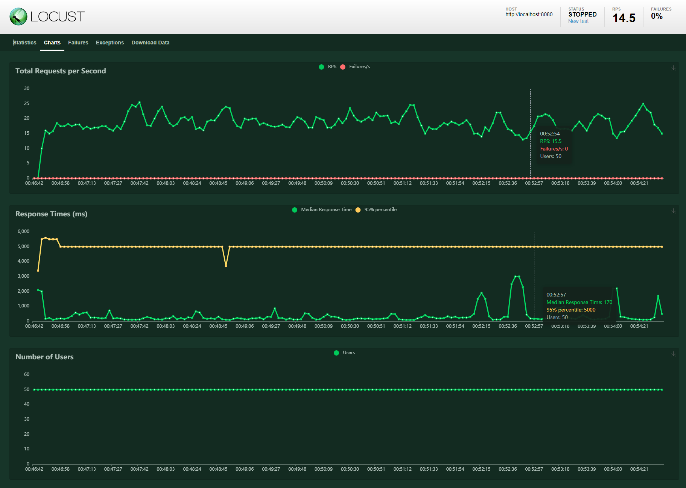

Akka-http-server:
- 
## Task:
To implement http aggregator/forwarder service which could accumulate http requests for some time (or # of income requests),
in order to reduce the network load. In fact, it is a PROXY
## IMPORTANT
It is a POC, test task, programing exercise, whatever but NOT a PRODUCTION-READY solution.I repeat NOT a PRODUCTION-READY solution.
For a production ready solutions please contact me for a commercial offer. 
- Basics:
  - Akka server
  - Akka http client  

- Implementation:
    - Story 1 +
    - Story 2 +
    - Story 3 +
- Tests
    - Basic at the moment
    
### Implementation details:
  - Most of the complexity goes from http-client-forwarder which need to aggregate multiple requests into one.
    Fortunately akka-http client based on streams have all this functionality from the box. 
    https://doc.akka.io/docs/akka/current/stream/operators/Source-or-Flow/groupedWithin.html
  - Config moved from explicit DI via a constructor into WithSettings trait
  - It could sound strange and weird, but if your endpoint backend service (xyz) have delay so ... aggregator also have delay,
and will return 'null' on the timeout.

### Configuration
For me the existing config file looks self-explanatory, but all the people have different cognitive abilities
so here we go:
- xyz-backend.max-elements <- the maximum number of elements in http-aggregator's queue to trigger the actual http call to xyz
- xyz-backend.finite-duration-seconds <- the maximum number of seconds (finite duration) in http-aggregator's queue to trigger the actual http call to xyz
- xyz-backend.backend-host <- Surprisingly, xyz hosts
- xyz-backend.backend-port <- xyz port, wow

### Run:
- git clone https://github.com/scarymrgrey/Akka-Http.Aggregator.Service.git
- cd Akka-Http.Aggregator.Service
- sbt run

### 0.0% of failed requests, median response time below 200ms, 95% percentile below 5 sec

